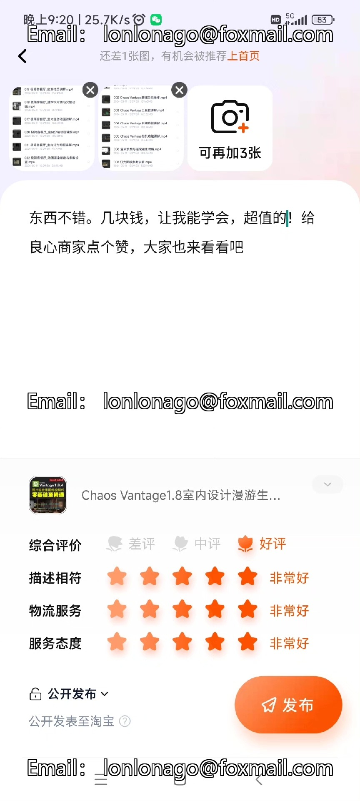
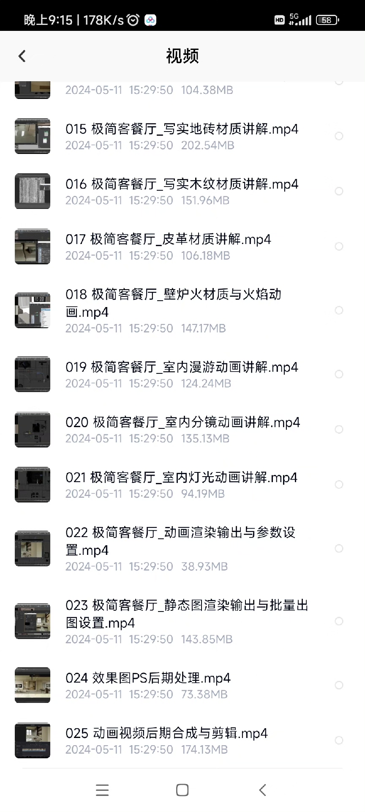
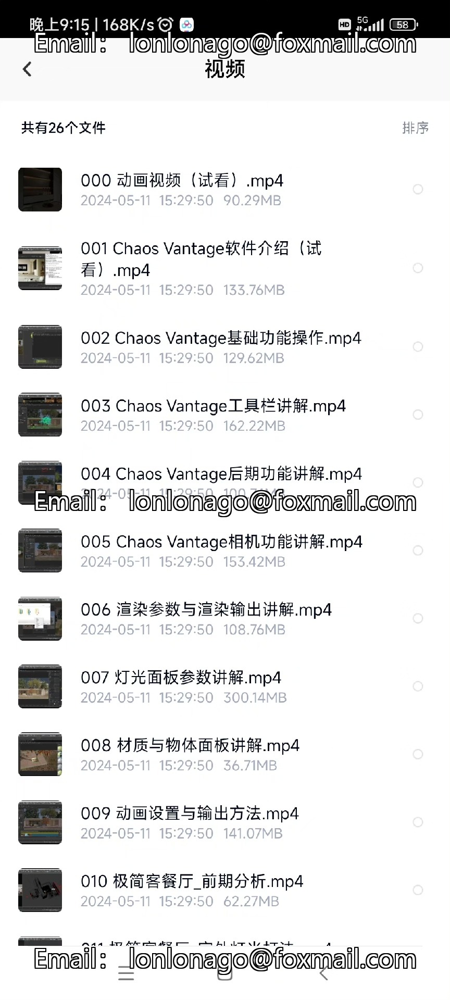

# Chaos Vantage, also known as CV renderer, is a course that teaches students how to use the Chaos Vantage renderer for lighting and material rendering. This course covers the basics of using the Chaos Vantage renderer, including setting up the renderer, creating materials, and applying lighting effects. Students will learn how to create realistic lighting and material effects in their scenes, and how to optimize their renders for better performance.

## Body

Chaos Vantage, also known as CV renderer, is a course on lighting, material rendering, and indoor static scene creation. It includes camera roaming growth animation videos and post-production output.

The course covers basic quick tutorials, workflow principles, and steps. It also discusses real-time connection and linkage, VR scene conversion with CV, and icon toolbars.

3D Max is a 3D modeling and rendering software, while V-Ray is a rendering engine. The full name of the CV renderer is Chaos Vantage, which is a real-time rendering GPU-based rendering engine.

If you are interested, click "I want" to chat with me privately!

## Images

## Payment

Here is a pay link on Stripe ( https://buy.stripe.com/3cs8yP7sY87d0vu9AB ). Please contact me lonlonago@foxmail.com after funding $89, and I will send you a complete data files , thank you!

